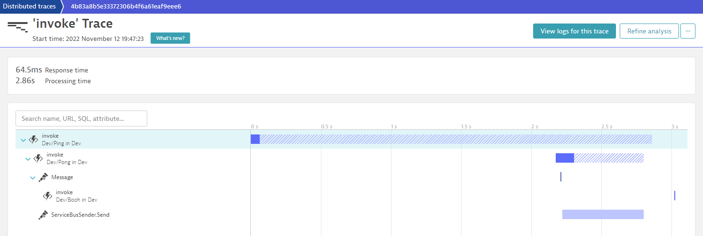

# Trace Azure Functions with Dynatrace

## Azure Functions 
Azure Functions offer a wide range of options   
* To use your preferred language 
* To automate deployment
* With flexible [hosting](https://docs.microsoft.com/en-us/azure/azure-functions/functions-scale)

to address the various [scenarios and use-cases](https://docs.microsoft.com/en-us/azure/azure-functions/functions-overview#scenarios).

## Distributed Tracing
[Dynatrace](https://www.dyntrace.com) offers an easy integration to [trace Azure Functions running on Appservice- (Dedicated) plan](https://www.dynatrace.com/support/help/setup-and-configuration/setup-on-cloud-platforms/microsoft-azure-services/integrate-oneagent-on-azure-functions/)

Tracing Azure Functions on a Consumption- or Premium-Plan, comes with certain challenges to it's nature of a fully managed service such as e.g. using instrumentation agents to automatically instrument your code at runtime. 

Dynatrace provides distributed tracing for these types based on [OpenTelemetry](https://opentelemetry.io/).

If you already use OpenTelemetry to instrument your functions you can ingest the telemetry either using the OpenTelemetry base functionality as explained within this [tutorial](https://github.com/dtPaTh/AzFuncOpenTelemetryDemo) or using the Dynatrace (PurePath) exporter which adds additional benefits to fully leverage the automatic analysis capabilties of Dynatrace. 

To make using OpenTelemetry easier, Dynatrace provides an [enhanced library for Azure Functions](https://www.dynatrace.com/support/help/setup-and-configuration/setup-on-cloud-platforms/microsoft-azure-services/opentelemetry-integration/opentelemetry-on-azure-functions) to reduce necessary OpenTelemetry boiler-plate code for trace-propagation, automatically applying resource attributes and initialization code as well to align with semantic conventions. 

## Eliminate the entry barrier
Wether you are new to OpenTelemetry or need to instrument thousands of functions or maybe just want to try out distributed tracing with minimal effort. The provided libary within this repository allows you to skip the need to fiddle around with OpenTelemetry or adding any additonal instrumentation code to your functions. 

### How-does it work?
The approach makes use of the [aspect oriented programming (AOP)](https://en.wikipedia.org/wiki/Aspect-oriented_programming) paradigm and dependency injection to add the necessary instrumentation code. 

## Features
The implementation is provided for .NET based functions targeting Azure Function runtime v4+. 

By default the instrumentation adds automatic function tracing for any function trigger type and enables automatic distributed tracing for following triggers: 
* **HttpTrigger**  using a *HttpRequest* binding
* **ServiceBusTrigger** using a *ServiceBusReceivedMessage* binding

You can enable .NET Framworks additional instrumentation such as [outgoing http or SQLclient calls](https://github.com/open-telemetry/opentelemetry-dotnet). 

Since October 2021, .NET Azure SDK comes with experimental OpenTelemetry support which gives additional trace details. While you can capture these spans span as [described here](https://devblogs.microsoft.com/azure-sdk/introducing-experimental-opentelemetry-support-in-the-azure-sdk-for-net/), the Azure.Function.Tracing library adds selected and validated instrumentation filters via simple TraceProviderBuilder extension methods:
* **AddServiceBusInstrumentation** adds spans for Azure.Messaging.ServiceBus Client

The repository contains 2 nuget packages: 

**PaTh.AzureFunctions.Tracing**

[](https://www.nuget.org/packages/Path.AzureFunctions.Tracing/)

Provides a IFunctionHostBuilder extension to register all necessary components in your functions [startup class](https://docs.microsoft.com/en-us/azure/azure-functions/functions-dotnet-dependency-injection). 

It allows you to add tracing if you already use a startup class or want to customize the TraceProvider configuration. 

By default the TraceProvider configuration adds automatic function tracing including distributed tracing for HttpTriggers, but does not enable any additional instrumentation such as [outgoing http or SQLclient calls](https://github.com/open-telemetry/opentelemetry-dotnet). 

See [1.1 Custom startup class (not necessary when using Azure.Functions.Tracing.Extra)](#1-add-necessary-nuget-packages-to-your-project-eg-via-command-line) to learn how to configure the traceprovider.

**PaTh.AzureFunctions.Tracing.Extra**

[](https://www.nuget.org/packages/Path.AzureFunctions.Tracing.Extra/)

Adds a [startup class](https://docs.microsoft.com/en-us/azure/azure-functions/functions-dotnet-dependency-injection) to your project and automatically enables distributed tracing for outgoing http and SQLClient calls by adding necessary dependencies and configuration for the instrumentation. 

### How-To use

#### 1. Add necessary nuget package(s) to your project e.g. via command line. 

Choose **PaTh.AzureFunctions.Tracing** if you want to use a custom startup class 
```
dotnet add package PaTh.AzureFunctions.Tracing
dotnet add package Microsoft.Azure.Functions.Extensions
``` 
or 

**PaTh.AzureFunctions.Tracing.Extra** to get easily started with an OOTB configuration. 
```
dotnet add package PaTh.AzureFunctions.Tracing.Extra
``` 
**Note:** You can only register a single startup class in Azure Functions. if you already use a startup class, you cannot use the *PaTh.AzureFunctions.Tracing.Extra* package. 

### 1.1 Custom startup class (not necessary when using Azure.Functions.Tracing.Extra)
If you are using a custom startup class, register necessary confguration with the extension method *AddFunctionTracing*

*AddFunctionTracing* allows to customize configuration of the traceprovider builder such as [enabling additional instrumentation](https://github.com/open-telemetry/opentelemetry-dotnet).

```
using Microsoft.Azure.Functions.Extensions.DependencyInjection;
using OpenTelemetry.Trace;
using Azure.Functions.Tracing;

[assembly: FunctionsStartup(typeof(MyNamespace.Startup))]

namespace MyNamespace
{
    public class Startup : FunctionsStartup
    {
        public override void Configure(IFunctionsHostBuilder builder)
        {
            builder.AddFunctionTracing(t =>
            {
                t.AddHttpClientInstrumentation(); //add httpclient instrumentation (requires OpenTelemetry.Instrumentation.Http)
                t.AddServiceBusInstrumentation(); //enable additional isntrumentation from Azure SDK
            });
        }
    }
}
``` 

### 2. Allow your Functions to be instrumented.
   
Constructor injection is used to make your dependencies available in a function. The use of constructor injection requires that you do not use static classes for your function classes.

Class inheritance is used to intercept your function, which requires to declare your function methods you want to be traced as *virtual*


If your function code looks like this
```
namespace MyNamespace
{
    public static class MyFunctions
    {
        [FunctionName("MyHttpTrigger")]
        public async Task<IActionResult> Run(
            [HttpTrigger(AuthorizationLevel.Function, "get", "post", Route = null) HttpRequest req, ILogger log)
            {
                //...
            }
    }
}
```

it should then look like this

```
namespace MyNamespace
{
    public class MyFunctions
    {
        [FunctionName("MyHttpTrigger")]
        public virtual async Task<IActionResult> Run(
            [HttpTrigger(AuthorizationLevel.Function, "get", "post", Route = null) HttpRequest req, ILogger log)
            {
                //...
            }
    }
}
```
### 3. Apply Dynatrace configuration
The Dynatrace package automatically reads the necessary configuration such as connection endpoints and authentication tokens, either from environment variables or a custom config file. To read more about configuration see [Dynatrace Help](https://www.dynatrace.com/support/help/setup-and-configuration/setup-on-cloud-platforms/microsoft-azure-services/opentelemetry-integration/opentelemetry-on-azure-functions)

## Examples
In the [/Examples](/Examples/) folder you find 2 Azure Function projects. Each containing 2 http triggered functions, where function *Ping* invokes function *Pong* via a http request.  




[HttpTriggers.Extra](/Examples/HttpTriggers.Extra/) is using Azure.Functions.Tracing.Extra which fully automatically enables tracing via it's included startup class.

[HttpTriggers](/Examples/HttpTriggers/) is using Azure.Functions.Tracing and a custom startup class to initialize tracing and adding HttpClient instrumentation. 

[HttpAndQueueTriggers](/Examples/HttpAndQueueTriggers/) is an advanced example showing distributed tracing for http and servicebus triggers. 

### Running the examples
To run the examples, you have to apply the necessary connection parameters in dtconfig.json as described in [Step #3 Apply Dynatrace configuration](#3._Apply_Dynatrace_configuration)

## Contribute
This is an open source project, and we gladly accept new contributions and contributors.  

## Support
This project is not an offical release of Dynatrace. If you have questions or any problems, open a github issue.  

## License
Licensed under Apache 2.0 license. See [LICENSE](LICENSE) for details.
